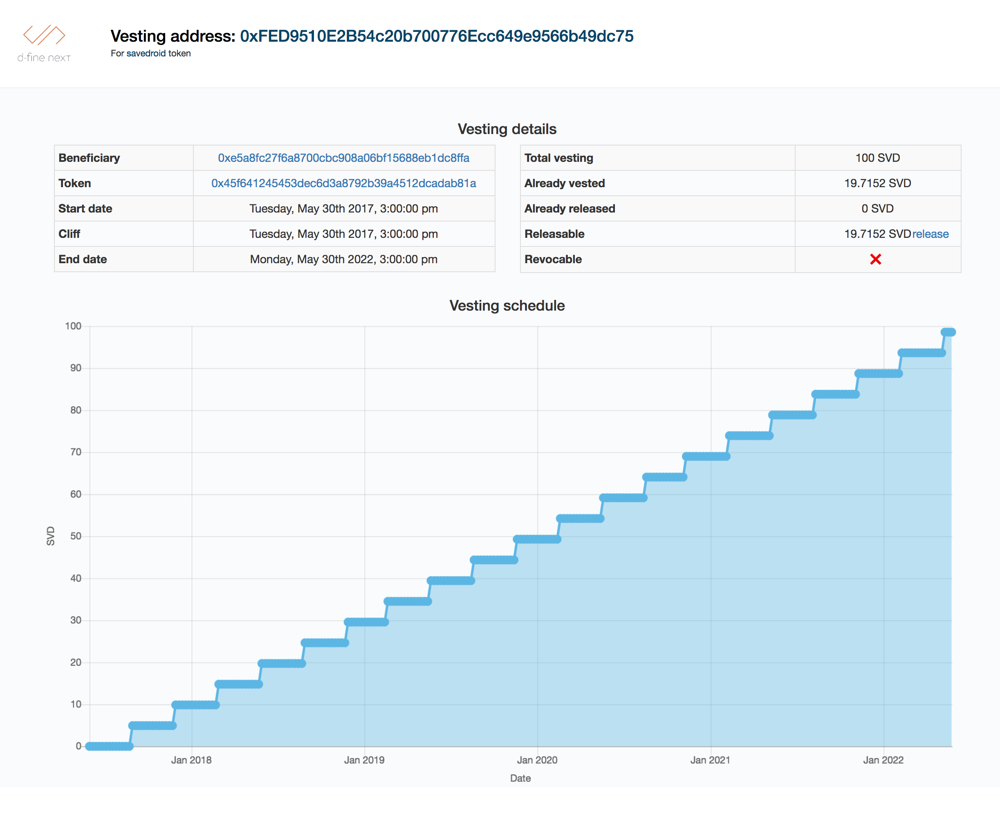

# SvdVesting + Dapp

A contract for vesting Savedroid-token and a web-based GUI to interact with the [Token Vesting contract](https://github.com/savedroid/svd-minting/blob/master/contracts/token/SvdVesting.sol).

This is strongly based on the [Token Vesting Dapp|https://github.com/OpenZeppelin/token-vesting-ui] from Open Zeppelin 

In the vesting contract ("trustee"), the contract owner defines grants to an Ethereum address ("vestee"), according to which a certain amount of token can be transferred during time. Each address can have only one grant. A grant has the following parameters:

| Name        | Type           | Description  |
| ------------- |:-------------:| -----:|
| value | `uint256` | the total value to be vested to the vestee | 
| start | `uint256` | the start date of the vesting period| 
| cliff | `uint256` | point in time of the end of the cliff period (when the first installment is made) |
| end   | `uint256` | the end date of the vesting period | 
| installmentLength | `uint256` | the length of period of each installment (in seconds) |
| transferred | `uint256` | the value that transferred to the vestee so far|
| revocable | `bool` | indicates whether the grant can be revoked by the owner| 

After the time has passed cliff, the vestee can unlock vested tokens. Thereby, tokens can be unlocked only if a new installment was generated by the trustee (i.e. when installmentLength has passed since the last unlock).

## Preparations

Make sure you have [Metamask](https://metamask.io/) installed, pointing to the right network and your account is unlocked. 

### 1. Run an Ethereum node
Install parity from https://www.parity.io/. 
Open a terminal, go to the parity directory and run

```text
parity
```

Alternatively start your own local network using [ganache](http://truffleframework.com/ganache/) or [ganache-cli](https://github.com/trufflesuite/ganache-cli).

### 2. Clone the repo
Open a terminal and run

```text
git clone git@github.com:d-fine/svd-vesting.git
```

### 3. Install the dependencies:
Run 

```text
npm install
npm install -g truffle
```

### 4. Deploy and collect addresses

First, compile the vesting contract:

```text
truffle compile
```

To deploy the vesting contract on the development network, run:

```text
truffle migrate --network development
```

Note that the deploying address must own some ether in order to execute the command.
The output will display the address of the deployed vesting contract.

**Be careful!** Every deploy on the same network replaces metadata (including the contract address) stored in the `build` directory.

### 5. Test

A comprehensive test suite is available and can be ran by:

```text
truffle test --network development
```

The usage of the contract can also be seen at

```text
truffle exec scripts/end2end_ganache.js --network development
```

Be sure to adapt all addresses in order for the scripts to run with your local setup

## Dapp Usage

### 1. Clone the repo
Open a new terminal and run

```text
git clone git@github.com:savedroid/svd-vesting.git
```

### 2. Install the dependencies
Run

```text
npm install
```

### 3. Build the contracts with truffle

```text
truffle compile
```

> Note: the `npx` command [comes with npm](https://medium.com/@maybekatz/introducing-npx-an-npm-package-runner-55f7d4bd282b) as of npm@5.2.0 version.

### 4. Start the web server

```text
npm run start
```

### 5. Ready!

Go to `http://localhost:3000/<token-vesting-address>/<beneficiary-address>`

When setting Metamask to Rinkeby, you can check following addresses:

[http://localhost:3000/0x92DF74d066D1D9a921D3CfC242AfBbFeEAFd53Bc/0xe5a8fc27f6a8700cbc908a06bf15688eb1dc8ffa](http://localhost:3000/0x92DF74d066D1D9a921D3CfC242AfBbFeEAFd53Bc/0xe5a8fc27f6a8700cbc908a06bf15688eb1dc8ffa)

or

[http://localhost:3000/0x92DF74d066D1D9a921D3CfC242AfBbFeEAFd53Bc/0x6b018f0b646f50a436e25d034624ed9b6a1d0bb7](http://localhost:3000/0x92DF74d066D1D9a921D3CfC242AfBbFeEAFd53Bc/0x6b018f0b646f50a436e25d034624ed9b6a1d0bb7)

for the contract deployed and veryfied [here](https://rinkeby.etherscan.io/address/0x92DF74d066D1D9a921D3CfC242AfBbFeEAFd53Bc)